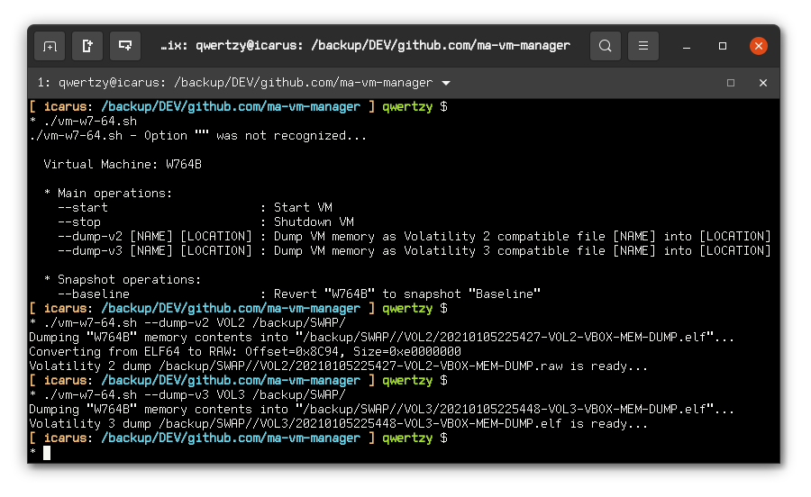

# vm-manager

Virtual Box easy-peasy VM manager from command line
A simple shell script to easy the start/shutdown and memory dump of a VirtualBox VM

  * Notes:

<b>vm-w7-32b-clean.sh:</b> is the VM to manage (1 file per VM)

Inside the vm file there are 2 variables:

<b>VM_NAME="W7-32B-Clean"</b>: variable with VM name

<b>VM_SNAPSHOT="Baseline"</b>: variable with snapshot name to revert to

* Main operations:

    --start                  : Start VM

    --stop                   : Shutdown VM

    --dump [NAME] [LOCATION] : Dump VM memory as file [NAME] into [LOCATION]

* Snapshot operations:

    --baseline               : Revert to snapshot
